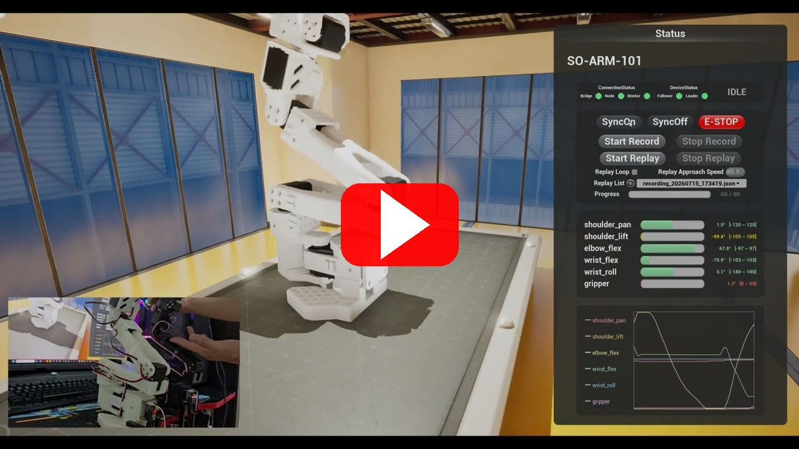
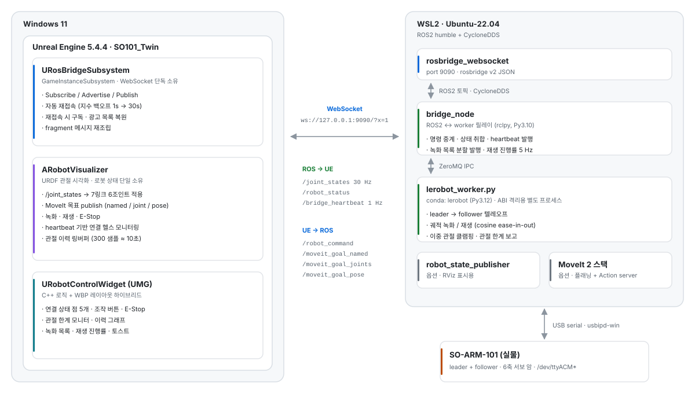

# UnrealRobotics-SO101

Unreal Engine 5.4 기반 **SO-ARM-101 로봇 디지털 트윈** 클라이언트.  
실물 로봇 ↔ Unreal 양방향 Sim-to-Real 디지털 트윈 (개인 프로젝트)

<p align="center">
  <a href="https://youtu.be/5SgQyp8pRQo">
    
  </a>
  <br>
  <a href="https://youtu.be/5SgQyp8pRQo"><b>▶ 데모 영상 보기 (YouTube)</b></a>
</p>

Stack: ROS2 Humble · MoveIt 2 · Unreal Engine 5.4.4 (C++ / UMG) · LeRobot · ZeroMQ · rosbridge · WSL2/Ubuntu

- **양방향 Sim-to-Real 파이프라인 구축**: 실물 SO-ARM-101(6축 서보 암)의 관절 상태를 30Hz로 Unreal 디지털 트윈에 실시간 반영하고, Unreal에서 지정한 목표 동작을 실물 로봇으로 하달하는 양방향 흐름을 처음부터 직접 구현.
- **MoveIt 2 모션 플래닝 통합**: Setup Assistant로 SRDF·kinematics·collision 설정 패키지를 구성하고, moveit_msgs/MoveGroup action client를 rclpy로 직접 작성. RViz·Unreal에서 IK/FK/named target으로 목표를 주면 플래닝→실물 실행까지 동작. 5DOF 로봇의 6DOF IK 실패를 진단하고 position-only goal로 우회.
- **모듈형 시스템 아키텍처 설계**: rclpy(Py3.10)와 LeRobot(Py3.12)의 ABI 비호환을 two-process + ZeroMQ IPC 구조로 해결. UE↔ROS2는 rosbridge WebSocket, ROS2 노드 간 통신은 CycloneDDS로 분리 구성. Worker / Bridge / Action server를 모듈로 분리하고 상태 머신(idle·sync·record·replay)으로 관리.
- **안정성·검증 로직**: 이중 관절 클램핑(session limit + 실측 physical limit), heartbeat 기반 자동 E-stop, Bridge/Worker 장애 분리 진단, USB 단선 자동 재연결 등 현장 운영을 가정한 안전 메커니즘 구현.
- **Record / Replay (Teach & Repeat)**: 관절 궤적 기록·재생 기능 구현 — 공장 반복 작업 자동화의 기본 단위. Cosine ease-in-out 보간으로 서보 충격 완화.
- **뷰포트 내 운영 UI (UMG)**: Details 패널 의존 조작을 전부 인게임 위젯으로 승격. C++가 로직·상태 폴링을 소유하고 WBP는 레이아웃만 담당하는 하이브리드 구조. 연결 계층 점 인디케이터, 관절 한계 모니터, 10초 이력 그래프, 토스트 알림, 녹화 목록·재생 진행률을 한 패널에서 처리.
- **인터랙션·비주얼 연출**: 로봇 클릭 → 카메라 블렌드 + 패널 슬라이드, 포스트프로세스 호버 아웃라인(16방향 레이 샘플링), 공장 씬 배치로 데모 완성도 확보. 시각 보정값은 실측값과 완전히 분리해 UI·경고·이력·실물 명령에 영향이 없도록 격리.
- **3D 에셋·좌표계 파이프라인**: URDF 메시(STL)를 Blender로 정리·FBX 변환, 7링크 6조인트를 Unreal SceneComponent 계층으로 구축. UE(cm·좌수계) ↔ ROS(m·우수계) 좌표·쿼터니언 변환 헬퍼 작성.

https://github.com/user-attachments/assets/0654abef-e979-4af7-bcd8-5db0cd8ebf9b

---

## Architecture

<p align="center">
  <picture>
    <source media="(prefers-color-scheme: dark)" srcset="docs/architecture-dark.svg">
    
  </picture>
</p>

### 데이터 흐름

| 방향 | 토픽 | 타입 |
|---|---|---|
| ROS → UE | `/joint_states` | `sensor_msgs/JointState` |
| ROS → UE | `/robot_status` | `std_msgs/String` (JSON) |
| ROS → UE | `/bridge_heartbeat` | `std_msgs/String` |
| UE → ROS | `/robot_command` | `std_msgs/String` (JSON) |
| UE → ROS | `/moveit_goal_named` | `std_msgs/String` |
| UE → ROS | `/moveit_goal_joints` | `sensor_msgs/JointState` |
| UE → ROS | `/moveit_goal_pose` | `geometry_msgs/PoseStamped` |

`/robot_status`는 worker state, device error, 관절 한계(`joint_limits`), 녹화 목록, 재생 진행률(5Hz)을 함께 실어 나른다. 녹화 목록은 응답이 커서 bridge가 **1건당 1메시지**로 분할 발행하고(`recording_item` / `index` / `total`), Unreal이 누적 조립한다.

---

## Prerequisites

### Windows side

| 항목 | 버전 |
|---|---|
| Unreal Engine | 5.4.4 (Epic Games Launcher) |
| Visual Studio | 2022, "Game development with C++" workload |
| OS | Windows 11 |
| Windows Terminal | Microsoft Store |
| usbipd-win | `winget install usbipd` |

### WSL2 side

| 항목 | 값 |
|---|---|
| Distro | Ubuntu-22.04 |
| ROS2 | humble + CycloneDDS (`rmw_cyclonedds_cpp`) |
| rosbridge | `ros-humble-rosbridge-suite` |
| LeRobot | `conda activate lerobot` |
| WSL2 networking | mirrored mode |

**WSL2 mirrored networking 설정** (`%UserProfile%\.wslconfig`):
```ini
[wsl2]
networkingMode=mirrored
```

---

## Setup

### 1. Clone & open in Unreal

```powershell
git clone https://github.com/Unity-SeungwooLee/UnrealRobotics-SO101.git
```

`SO101_Twin.uproject`를 우클릭 → **Generate Visual Studio project files** 실행 후 Unreal Editor에서 열기.  
메인 레벨은 `Content/SO101_ROS.umap` — 로봇 액터, 클로즈업/기본 카메라, 공장 씬, 아웃라인용 PostProcessVolume이 모두 이 레벨에 배치되어 있다.

### 2. Build (command line)

```powershell
& "C:\Program Files (x86)\UE_5.4\Engine\Build\BatchFiles\Build.bat" `
  SO101_TwinEditor Win64 Development `
  -Project="$PWD\SO101_Twin.uproject" -WaitMutex
```

### 3. Project Settings (호버 아웃라인 사용 시 1회)

**Project Settings → Rendering → Postprocessing → Custom Depth-Stencil Pass = `Enabled with Stencil`**  
기본값 `Enabled`는 스텐실을 포함하지 않아 아웃라인이 동작하지 않는다.

### 4. 시스템 실행

#### GUI 런처 (권장)

```powershell
powershell -ExecutionPolicy Bypass -File .\so101_launcher.ps1
```

WPF 버튼 패널이 열린다. Normal Mode 또는 MoveIt Mode 버튼으로 한 번에 실행.

#### CLI 런처

```powershell
# 일반 모드 (Worker + Bridge + rosbridge — Windows Terminal 3탭)
.\launch_so101.ps1

# MoveIt 모드 (위 3탭 + RSP + MoveIt + GoalNode + ActionServer — 7탭)
.\launch_so101.ps1 -Mode moveit

# USB 이미 연결된 경우 스킵
.\launch_so101.ps1 -SkipUSB
```

### 5. 연결 확인

```powershell
Test-NetConnection -ComputerName localhost -Port 9090
```

`TcpTestSucceeded : True`가 나오면 Unreal Editor에서 Play.  
시연·녹화 시에는 PIE를 `New Editor Window` + 1920×1080으로 두고 UMG DPI Scale Rule은 `Shortest Side`를 사용한다.

---

## PowerShell Scripts

| 스크립트 | 용도 |
|---|---|
| `so101_launcher.ps1` | WPF GUI — 모든 스크립트의 버튼 패널 |
| `launch_so101.ps1` | USB attach + WSL2 탭 실행 (`-Mode normal\|moveit`, `-SkipUSB`) |
| `stop_so101.ps1` | WSL2 프로세스 일괄 종료 (`-DetachUSB` 옵션) |
| `reattach_usb.ps1` | USB detach → reattach 강제 리셋 (포트 stuck 시) |

---

## Project Structure

```
SO101_Twin.uproject
Source/
  SO101_Twin/
    RosBridge/
      RosBridgeSubsystem.h/.cpp   # WebSocket 소유 GameInstanceSubsystem
      RosBridgeLog.h/.cpp         # 전용 로그 카테고리
      RosTestActor.h/.cpp         # 연결 테스트 액터
    Robot/
      RobotVisualizer.h/.cpp      # URDF 시각화 + 제어 + 로봇 상태 소유
      RosCoordConv.h              # 좌표계 변환 헬퍼 (ROS ↔ UE)
    UI/
      RobotControlWidget.h/.cpp   # 뷰포트 조작·모니터링 패널 (로직 베이스)
      JointRowWidget.h/.cpp       # 관절 1개 행 (이름 / 각도 / 범위 바)
      JointGraphWidget.h/.cpp     # 6관절 이력 그래프 (NativePaint 직접 렌더)
      ToastWidget.h/.cpp          # 슬라이드 토스트 알림
      RecordingEntryWidget.h/.cpp # 녹화 목록 행 + 데이터 오브젝트
    SO101_Twin.Build.cs
Content/
  SO101_ROS.umap                  # 메인 레벨 (로봇 + 카메라 + 공장 씬)
  Robot/Meshes/                   # URDF → FBX 변환 메시
  UI/                             # WBP_RobotControl / JointRow / JointGraph /
                                  #   Toast / RecordingEntry
  Materials/  Meshes/  Textures/  # 공장 씬 + 호버 아웃라인 머티리얼
Config/
  DefaultEngine.ini  DefaultGame.ini  DefaultInput.ini  DefaultEditor.ini
```

모듈 의존성 — public: `Core` · `CoreUObject` · `Engine` · `InputCore` · `EnhancedInput` · `UMG` · `Slate` · `SlateCore` / private: `WebSockets` · `Json` · `JsonUtilities`.

---

## Key Components

### URosBridgeSubsystem

`UGameInstanceSubsystem`으로 WebSocket 연결을 단독 소유. 레벨 이동 시에도 연결이 유지된다.

```cpp
URosBridgeSubsystem* Ros = GetGameInstance()->GetSubsystem<URosBridgeSubsystem>();
Ros->OnConnected.AddDynamic(this, &AMyActor::OnRosConnected);
Ros->Connect(TEXT("ws://127.0.0.1:9090/?x=1"));

// OnRosConnected() 내부:
Ros->Subscribe(TEXT("/joint_states"), TEXT("sensor_msgs/JointState"));
Ros->Advertise(TEXT("/cmd_vel"), TEXT("geometry_msgs/Twist"));
Ros->Publish(TEXT("/cmd_vel"), TEXT("{\"linear\":{\"x\":0.5},\"angular\":{\"z\":0.0}}"));
```

- 연결 끊김 시 지수 백오프(1s → 30s)로 자동 재접속
- 재접속 후 Subscribe / Advertise 목록 자동 복원
- rosbridge `fragment` 메시지를 id별 버퍼에 모았다가 재조립 후 디스패치
- `OnConnected` / `OnDisconnected` / `OnTopicMessage` Blueprint 델리게이트 제공

### ARobotVisualizer

SO-ARM-101의 URDF 링크/조인트 구조를 UE 컴포넌트 계층(7링크 6조인트)으로 재현하여 `/joint_states`에 따라 실시간 시각화. 로봇 상태의 단일 소유자이며, UI 위젯은 이 액터에서만 값을 읽는다.

**MoveIt 명령 (Details 패널 > ROS|MoveIt):**
- `SendNamedTarget()` — "home", "ready" 등 명명된 자세 전송
- `SendJointGoal()` — 관절 각도(rad) 직접 지정
- `SendPoseGoal()` — UE 좌표(cm) → ROS 좌표(m) 자동 변환 후 위치 목표 전송

**녹화 / 재생 / 안전 (Details 패널 또는 뷰포트 UI):**
- `SyncOn()` / `SyncOff()` — 리더→팔로워 텔레오프 on/off
- `StartRecord()` / `StopRecord()` — 관절 궤적 녹화
- `StartReplay()` / `StopReplay()` — 녹화 궤적 재생 (loop, approach speed 5~300°/s)
- `EStop()` — 모든 모션 즉시 정지

**연결 헬스 모니터링:**
- `/bridge_heartbeat` (1 Hz) 수신 감시 — 4초 이상 없으면 경고
- `/joint_states` (30 Hz) 수신 감시 — 3초 이상 없으면 워커 오프라인 경고
- 팔로워/리더 장치 오류 (`device_error`) 감지

**관절 모니터링 데이터:**
- worker가 보고한 `joint_limits`(deg)를 단일 소스로 저장 — Unreal 쪽 하드코딩 없음
- `GetJointAngleDeg` / `GetJointRangeAlpha` / `GetJointWarnLevel` (Normal · Caution · Danger)
- 관절별 300샘플(30Hz ≈ 10초) 링버퍼 → `GetJointHistory`

**시각 보정 / 인터랙션:**
- `VisOffset*Deg` 6개 — URDF home pose와 LeRobot calibration zero point 차이를 Unreal 쪽에서만 보정. `CurrentJointDeg` 캐싱 **이후**에 더해져 회전에만 쓰이므로 UI·한계·경고·이력·실물 명령에는 영향이 없다
- 메시 호버 시 Custom Depth 스텐실 토글 → 포스트프로세스 아웃라인. 팔이 15개 메시로 분할돼 있어 `TSet` 카운팅으로 경계 깜빡임을 제거
- 메시 클릭 → 컨트롤 패널 슬라이드 인 + `SetViewTargetWithBlend`(Cubic) 클로즈업 전환, 빈 곳 클릭 시 자유 시점 복귀

### 뷰포트 UI (URobotControlWidget 계열)

C++가 액터 탐색·상태 폴링(5Hz)·버튼 핸들러를 담당하고 WBP는 레이아웃만 제공한다. Blueprint 스크립팅 없이 위젯 이름 바인딩(`BindWidget`)만으로 연결된다.

- **연결 계층 점 5개** — `BridgeDot` → `NodeDot` → `WorkerDot` → `FollowerDot` / `LeaderDot`. 왼쪽에서부터 초록이 끊기는 지점이 곧 확인해야 할 구간
- **Worker 상태 텍스트** — RECORDING / REPLAYING / SYNCING / IDLE
- **조작 버튼 6종 + E-Stop** — 상태별로 활성/비활성이 갈리는 워크플로우 가드 내장
- **녹화 목록** — 최신순 드롭다운, 선택 시 파일명 자동 입력. 연결 직후 유실되는 1회성 요청은 2초 간격으로 재시도하다 도착하면 중단
- **재생 진행률** — ProgressBar + `N / Total`, approach 구간은 별도 표기
- **관절 모니터** — `WBP_JointRow` 6개를 C++가 동적 생성. 잔여 각도 **절대값** 기준 경고(≤10° 노랑, ≤3° 빨강 — gripper의 좁은 가동 범위 때문에 % 대신 절대값 사용)
- **이력 그래프** — `NativePaint`로 직접 렌더. Y축을 관절별 range로 정규화해 **그래프 상/하단이 곧 물리 한계**, X축은 최근 10초(최신값 우측 고정)
- **토스트 알림** — 액터가 뷰포트에 직접 추가하는 독립 위젯. 상태 변화·USB 에러·녹화 저장을 에지 검출로 큐잉하고 코사인 ease-in/out으로 슬라이드

### RosCoordConv

```cpp
// ROS → UE
FVector uePos = RosCoordConv::RosToUePosition(x_m, y_m, z_m);
FQuat   ueQuat = RosCoordConv::RosQuatToUe(qx, qy, qz, qw);
float   ueDeg = RosCoordConv::RosJointAngleToUeDegrees(angle_rad);

// UE → ROS
double rx, ry, rz;
RosCoordConv::UeToRosPosition(uePos, rx, ry, rz);
```

---

## Coordinate Conversion

| | Unit | Handedness | Up | Forward |
|---|---|---|---|---|
| Unreal | cm | Left-handed | Z | X |
| ROS | m | Right-handed | Z | X |

변환 규칙: 위치는 ×100 후 Y 반전, 쿼터니언은 Y·W 부호 반전, 관절 각도는 부호 반전.  
씬이 "좌우 반전"처럼 보이면 좌표 변환 누락을 먼저 의심할 것.

---

## USB Management (usbipd-win)

SO-ARM-101의 리더/팔로워 암은 USB-Serial로 연결된다. usbipd로 WSL2에 전달해야 한다.

| 버스 ID | 역할 |
|---|---|
| `1-7` | Follower arm |
| `3-2` | Leader arm |

```powershell
# 현재 상태 확인
usbipd list

# 수동 attach
usbipd attach --wsl --busid 1-7
usbipd attach --wsl --busid 3-2

# WSL2에서 장치 확인
wsl -d Ubuntu-22.04 -- ls /dev/ttyACM*
```

장치가 stuck 상태이면 `.\reattach_usb.ps1`로 강제 리셋.

---

## Roadmap

- [x] rosbridge WebSocket 클라이언트 + 자동 재접속 / fragment 재조립
- [x] URDF 관절 실시간 시각화 (`/joint_states` 30Hz)
- [x] UE → ROS 명령 publish + MoveIt 2 연동
- [x] Record / Replay (Teach & Repeat) + E-Stop
- [x] 연결 헬스 모니터링 · 장치 오류 감지
- [x] 뷰포트 UMG 운영 UI (안전 · 조작 · 관절 모니터링 · 이력 그래프)
- [x] 호버 아웃라인 · UI 비주얼 업그레이드 · 공장 씬 배치
- [ ] Imitation Learning (LeRobot) — 카메라 확보 후 착수 예정
- [ ] VLA (Vision-Language-Action)

---

## License

This project is for research and educational purposes.
